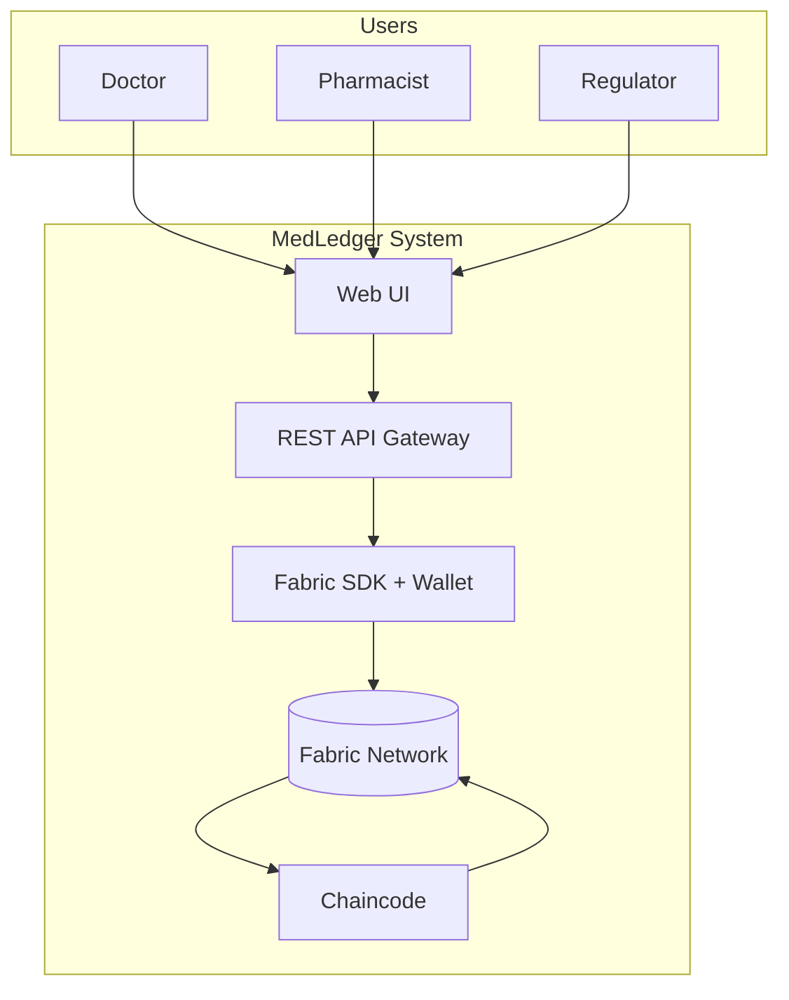
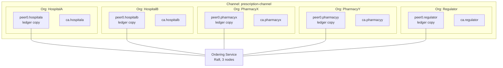
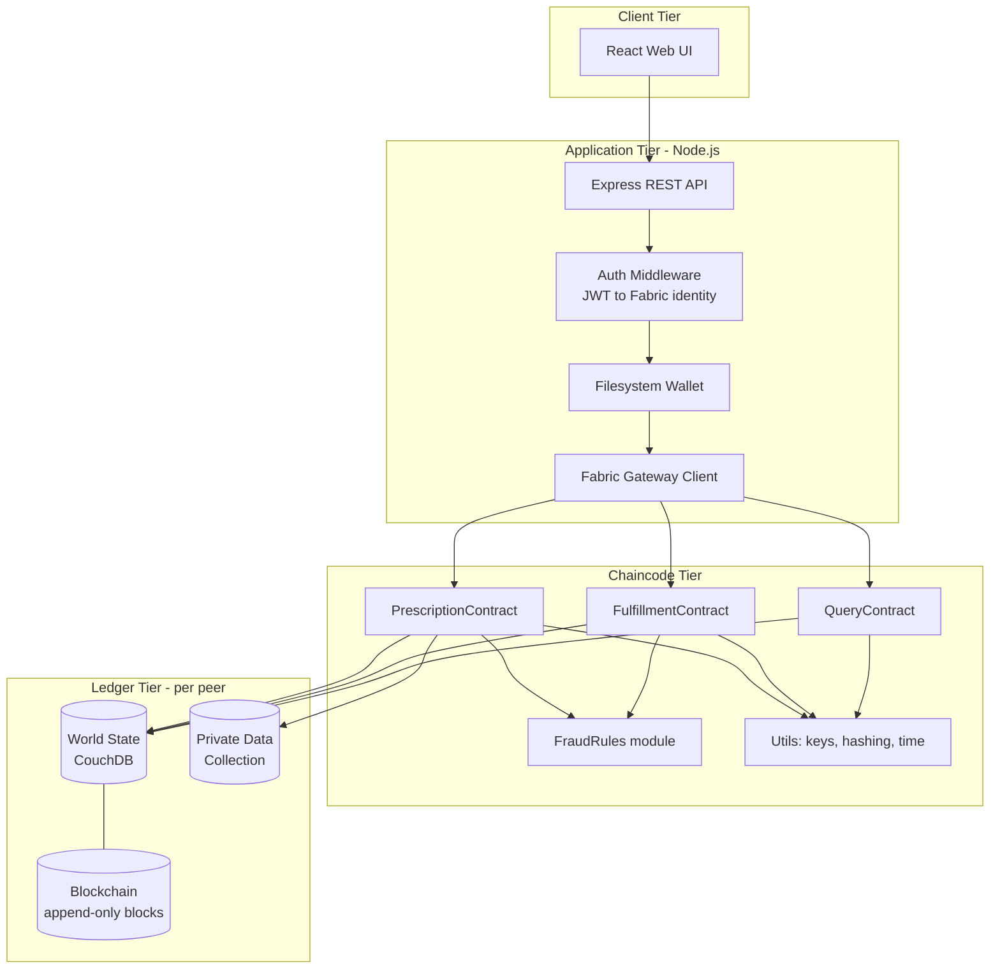
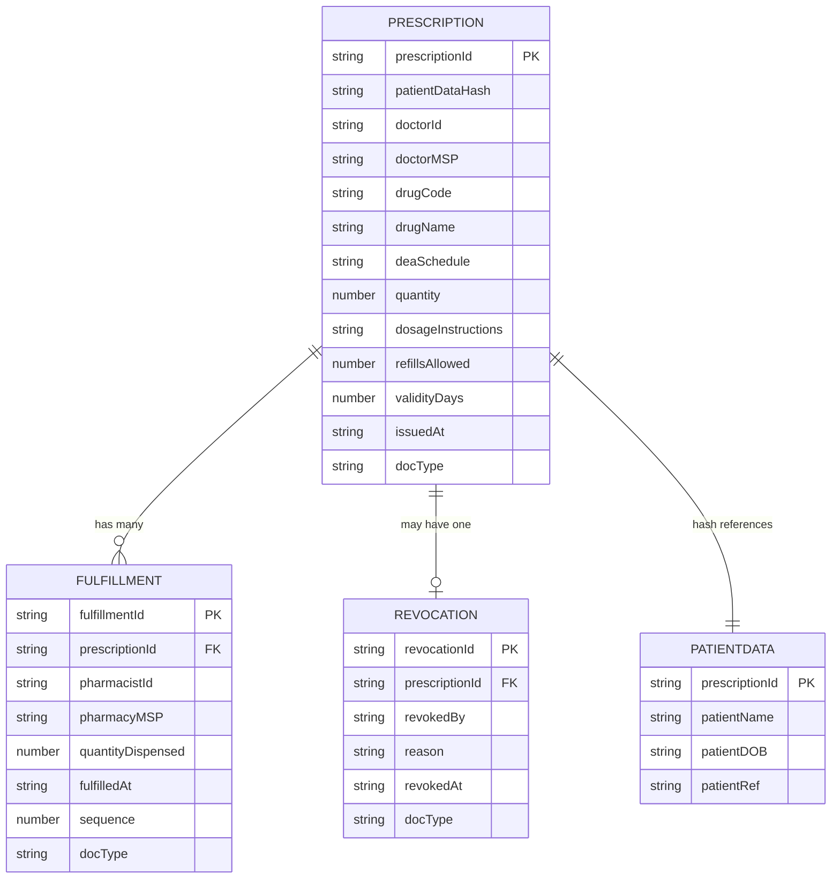
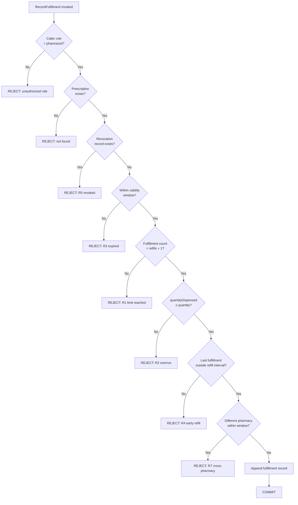
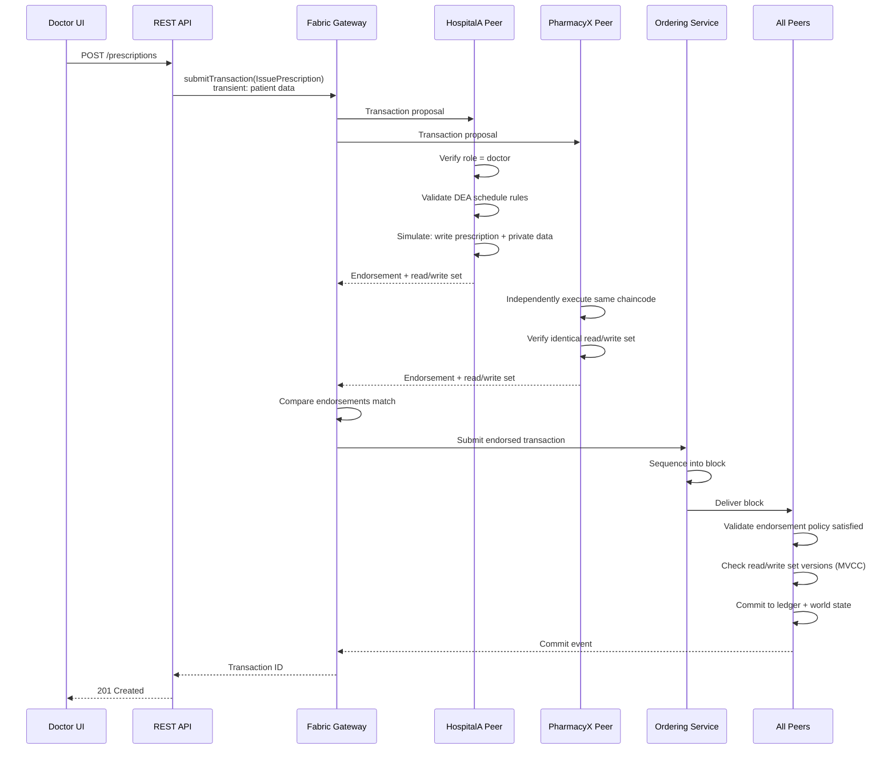
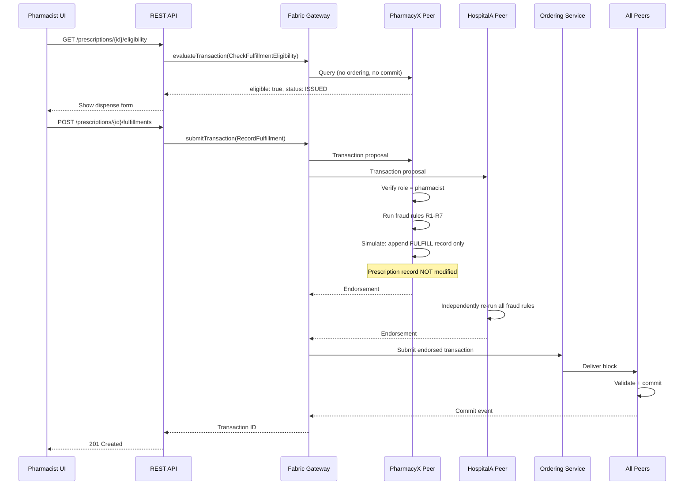
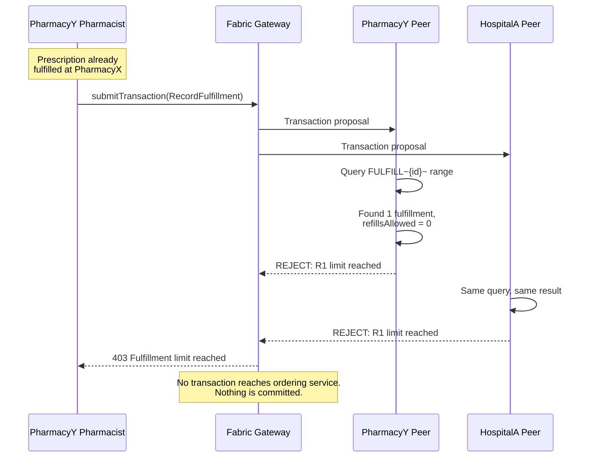
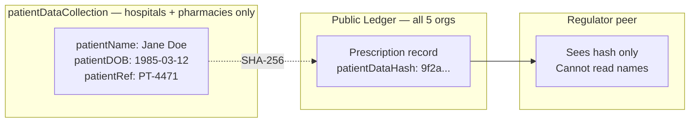
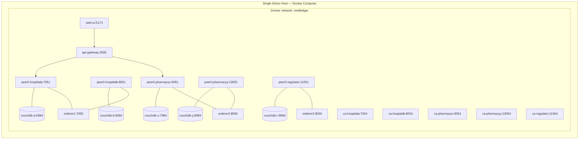

# Design — MedLedger

**Companion to:** `spec.md`
**Scope:** Architecture, high-level design, low-level design, technology stack, component breakdown

---

## 1. Architectural Overview

MedLedger is a **permissioned consortium blockchain**. Five organizations participate, each running its own peer and certificate authority. No organization holds an authoritative copy of the data; all hold equal copies, and a record is only valid once the endorsement policy is satisfied across organizational boundaries.

The architecture is layered:

| Layer | Responsibility |
|---|---|
| **Presentation** | Role-specific web UI (doctor, pharmacist, regulator) |
| **Application** | REST API gateway; identity wallet management; transaction submission |
| **Smart contract** | Chaincode enforcing all business and fraud rules |
| **Ledger** | Immutable blockchain + world state per peer |
| **Network** | Peers, ordering service, CAs, channel configuration |

### 1.1 System Context



---

## 2. Network Topology

Five organizations, one channel, one shared ledger.



### 2.1 Organization Roles

| Organization | MSP ID | Purpose | Endorses? |
|---|---|---|---|
| HospitalA | `HospitalAMSP` | Issues prescriptions | Yes |
| HospitalB | `HospitalBMSP` | Issues prescriptions | Yes |
| PharmacyX | `PharmacyXMSP` | Records fulfillments | Yes |
| PharmacyY | `PharmacyYMSP` | Records fulfillments | Yes |
| Regulator | `RegulatorMSP` | Read-only oversight | No (query only) |

### 2.2 Endorsement Policy

```
AND(
  OR('HospitalAMSP.peer', 'HospitalBMSP.peer'),
  OR('PharmacyXMSP.peer', 'PharmacyYMSP.peer')
)
```

**Rationale:** Every state-changing transaction requires agreement from both sides of the trust boundary. A hospital cannot commit a prescription without a pharmacy independently validating it, and a pharmacy cannot commit a fulfillment without a hospital peer independently confirming the underlying prescription and fraud rules. This is the structural property that makes unilateral fraud impossible.

---

## 3. High-Level Design

### 3.1 Component Diagram



### 3.2 Layer Responsibilities

| Component | Responsibility | Must NOT do |
|---|---|---|
| Web UI | Render role-appropriate forms and views | Contain business rules |
| REST API | Map HTTP to chaincode invocations, manage sessions | Validate fraud rules |
| Wallet | Store and retrieve X.509 identities | Generate identities at request time |
| Chaincode | Enforce **all** business and fraud rules | Perform non-deterministic operations |
| World State | Serve current-value queries | Be treated as authoritative over the blockchain |

> **Critical placement rule:** Fraud rules live in chaincode only. If a rule is enforced in the REST API, a malicious organization can bypass it by invoking chaincode directly with its own client. The API layer may duplicate checks for user experience, but chaincode is the enforcement point.

---

## 4. Low-Level Design

### 4.1 Ledger Key Schema

Composite keys allow prefix-range queries without relying on CouchDB indexes for core operations.

| Entity | Key format | Example |
|---|---|---|
| Prescription | `PRESC~{prescriptionId}` | `PRESC~a3f1c9e2-...` |
| Fulfillment | `FULFILL~{prescriptionId}~{sequence}` | `FULFILL~a3f1c9e2-...~0` |
| Revocation | `REVOKE~{prescriptionId}` | `REVOKE~a3f1c9e2-...` |
| Doctor index | `DOCIDX~{doctorId}~{prescriptionId}` | For "my prescriptions" queries |

Retrieving all fulfillments for a prescription is a partial composite key range query on `FULFILL~{prescriptionId}~`, which is deterministic and index-free.

### 4.2 Data Model



**Note the absence of a `status` field.** This is deliberate and load-bearing. See §4.4.

### 4.3 Chaincode Function Signatures

```
// PrescriptionContract
IssuePrescription(ctx, prescriptionId, drugCode, drugName, deaSchedule,
                  quantity, dosageInstructions, refillsAllowed, validityDays)
    → transient map carries: patientName, patientDOB, patientRef
RevokePrescription(ctx, prescriptionId, reason)
ReadPrescription(ctx, prescriptionId)
ReadPatientData(ctx, prescriptionId)              // private collection

// FulfillmentContract
RecordFulfillment(ctx, prescriptionId, quantityDispensed)
GetFulfillments(ctx, prescriptionId)

// QueryContract
GetPrescriptionStatus(ctx, prescriptionId)        // derived, never stored
GetPrescriptionHistory(ctx, prescriptionId)       // full tx history, audit
GetPrescriptionsByDoctor(ctx, doctorId)
CheckFulfillmentEligibility(ctx, prescriptionId, quantityRequested)
```

Patient-identifying fields are passed via the **transient data map**, not as ordinary arguments. Ordinary arguments are written into the transaction proposal and therefore onto the blockchain of every org; transient data is not.

### 4.4 Status Derivation Algorithm

```
function GetPrescriptionStatus(prescriptionId):
    prescription ← getState(PRESC~prescriptionId)
    if prescription is null: throw NotFound

    revocation ← getState(REVOKE~prescriptionId)
    if revocation exists: return REVOKED

    fulfillments ← getStateByPartialCompositeKey(FULFILL~prescriptionId~)
    maxDispenses ← prescription.refillsAllowed + 1

    if count(fulfillments) ≥ maxDispenses:
        return FULLY_FULFILLED

    now ← txTimestamp
    expiry ← prescription.issuedAt + prescription.validityDays
    if now > expiry:
        return EXPIRED

    if count(fulfillments) == 0:
        return ISSUED
    else:
        return PARTIALLY_FULFILLED
```

**Ordering matters.** `REVOKED` precedes all others. `FULLY_FULFILLED` is evaluated before `EXPIRED` so that a completed prescription does not later appear expired.

### 4.5 Fraud Rule Evaluation Order



---

## 5. Transaction Flows

### 5.1 Prescription Issuance



### 5.2 Fulfillment Recording



### 5.3 Fraud Attempt — Duplicate Fulfillment at a Second Pharmacy



**This is the core demonstration.** PharmacyY cannot fulfill even though it never saw the original dispense — because it holds the same ledger, and because HospitalA's peer independently reached the same conclusion.

---

## 6. Technology Stack

| Layer | Technology | Version target | Rationale |
|---|---|---|---|
| Blockchain framework | Hyperledger Fabric | 2.5 LTS | Permissioned, pluggable consensus, private data support |
| Consensus | Raft (etcdraft) | Built-in | Crash-fault tolerant, production default for Fabric 2.x |
| Chaincode language | **Go** | 1.21+ | Best-supported chaincode language; strong typing catches determinism bugs at compile time |
| Chaincode SDK | `fabric-contract-api-go` | Latest | Official contract API |
| State database | CouchDB | 3.3 | Rich JSON queries for audit views |
| Application runtime | Node.js | 20 LTS | Mature Fabric Gateway SDK |
| Application SDK | `@hyperledger/fabric-gateway` | 1.4+ | Modern gateway API, replaces legacy `fabric-network` |
| REST framework | Express | 4.x | Minimal, well-understood |
| Web UI | React + Vite | 18 / 5 | Fast dev loop |
| UI styling | Tailwind CSS | 3.x | Rapid role-specific layouts |
| Containerization | Docker + Docker Compose | 24+ / v2 | Standard Fabric test-network approach |
| Certificate authority | Fabric CA | 1.5+ | Per-org identity issuance |
| Testing | Go `testing` + `testify`; Jest for API | — | Unit tests for chaincode rules |

### 6.1 Language Choice Note

Chaincode is specified in **Go** rather than JavaScript. Fabric's Go contract API is the most mature, and Go's explicit error handling and absence of implicit type coercion reduce the risk of non-deterministic endorsement failures (NFR-7). The application tier remains Node.js, so the project is bilingual: Go for the contract, TypeScript/JavaScript for everything above it.

---

## 7. Private Data Design



**Collection definition (`collections_config.json`):**

| Property | Value |
|---|---|
| `name` | `patientDataCollection` |
| `policy` | `OR('HospitalAMSP.member','HospitalBMSP.member','PharmacyXMSP.member','PharmacyYMSP.member')` |
| `requiredPeerCount` | 1 |
| `maxPeerCount` | 3 |
| `blockToLive` | 0 (retain indefinitely) |
| `memberOnlyRead` | true |
| `memberOnlyWrite` | true |

The hash on the public ledger still provides tamper evidence: anyone can verify that private data matching a given hash existed at a given block height, without seeing its contents.

---

## 8. Deployment Architecture



---

## 9. Repository Structure

```
medledger/
├── README.md
├── spec.md
├── design.md
├── plan.md
├── network/
│   ├── docker-compose.yaml
│   ├── configtx.yaml
│   ├── crypto-config.yaml
│   ├── collections_config.json
│   └── scripts/
│       ├── up.sh
│       ├── down.sh
│       ├── createChannel.sh
│       ├── deployChaincode.sh
│       └── enrollUsers.sh
├── chaincode/
│   └── medledger/
│       ├── go.mod
│       ├── main.go
│       ├── contracts/
│       │   ├── prescription.go
│       │   ├── fulfillment.go
│       │   └── query.go
│       ├── models/
│       │   ├── prescription.go
│       │   ├── fulfillment.go
│       │   └── revocation.go
│       ├── rules/
│       │   └── fraud.go
│       ├── utils/
│       │   ├── keys.go
│       │   ├── identity.go
│       │   └── timestamp.go
│       └── contracts/*_test.go
├── api/
│   ├── package.json
│   ├── src/
│   │   ├── server.js
│   │   ├── gateway.js
│   │   ├── wallet.js
│   │   ├── middleware/auth.js
│   │   └── routes/
│   │       ├── prescriptions.js
│   │       ├── fulfillments.js
│   │       └── audit.js
│   └── test/
├── web/
│   ├── package.json
│   └── src/
│       ├── App.jsx
│       └── views/
│           ├── DoctorView.jsx
│           ├── PharmacistView.jsx
│           └── RegulatorView.jsx
└── demo/
    ├── seed.sh
    └── fraud-scenarios.sh
```

---

## 10. Key Design Decisions

| # | Decision | Alternative rejected | Reason |
|---|---|---|---|
| D1 | Status derived at query time | Stored mutable `status` field | A pharmacy cannot modify a doctor-signed record without invalidating it; append-only ledgers have no update primitive |
| D2 | Endorsement policy spans hospital AND pharmacy | Single-org endorsement | Cross-boundary agreement is the entire point of using a blockchain here |
| D3 | Go for chaincode | JavaScript | Determinism safety; mature contract API |
| D4 | Patient data in private collection | Full patient data on ledger | Every org would otherwise hold PHI for every patient in the network |
| D5 | Transient data for patient fields | Regular chaincode arguments | Regular arguments are written to the blockchain of every org |
| D6 | Composite keys with range queries | CouchDB rich queries for core paths | Rich queries are not re-executed deterministically during validation |
| D7 | Fraud rules only in chaincode | Duplicated in API as enforcement | API can be bypassed by direct chaincode invocation |
| D8 | Regulator excluded from private collection | Regulator included | Demonstrates data minimization; regulator can be granted access via governance if needed |

> **On D6:** CouchDB rich queries (`GetQueryResult`) are evaluated during simulation but **not** re-evaluated at validation time, so results can be stale by commit time. They are safe for read-only query functions, and unsafe inside functions that write state based on their results. Core fraud checks therefore use deterministic composite-key range queries.
