# Design — MedLedger

**Companion to:** `spec.md`
**Scope:** Architecture, high-level design, low-level design, technology stack, component breakdown

---

## 1. Architectural Overview

MedLedger is a **permissioned consortium blockchain**. Five organizations participate, each running its own peer and certificate authority. No organization holds an authoritative copy of the data; all hold equal copies, and a record is only valid once the endorsement policy is satisfied across organizational boundaries.

The architecture is layered:

| Layer | Responsibility |
|---|---|
| **Presentation** | Role-specific web UI (doctor, pharmacist, regulator) |
| **Application** | REST API gateway; identity (cert + key) management; transaction submission |
| **Smart contract** | Chaincode enforcing all business and fraud rules |
| **Ledger** | Immutable blockchain + world state per peer |
| **Network** | Peers, ordering service, CAs, channel configuration |

### 1.1 System Context

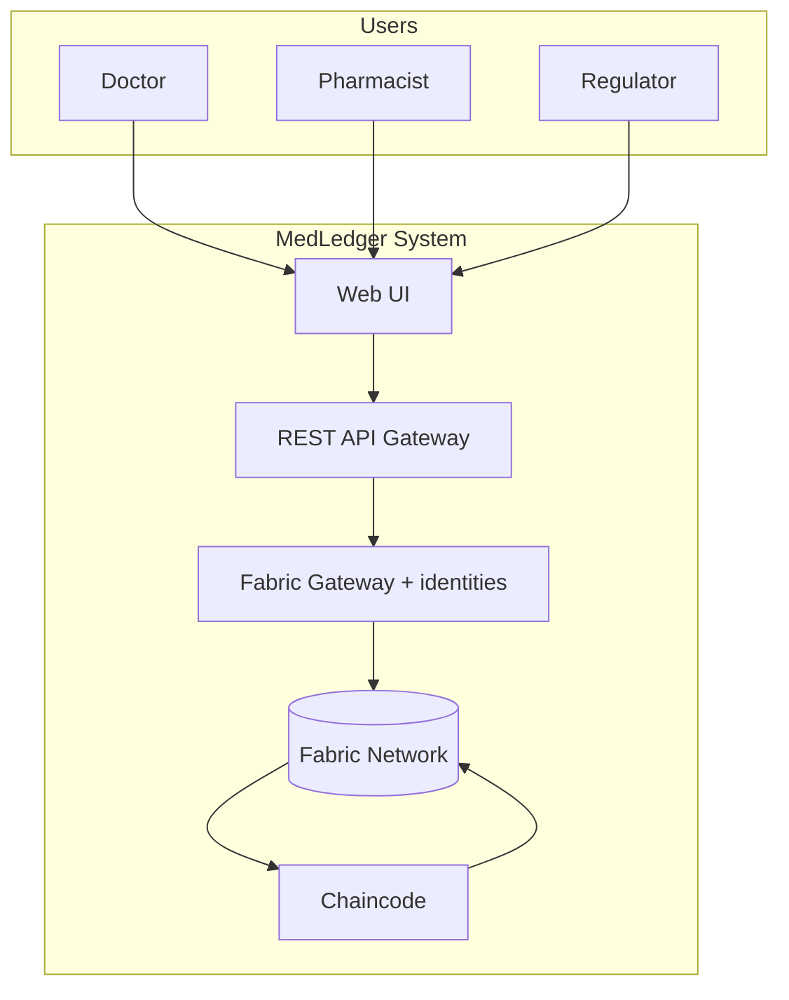
```mermaid
graph TB
    subgraph Users
        D[Doctor]
        P[Pharmacist]
        R[Regulator]
    end

    subgraph MedLedger["MedLedger System"]
        UI[Web UI]
        API[REST API Gateway]
        SDK[Fabric Gateway + identities]
        CC[Chaincode]
        NET[(Fabric Network)]
    end

    D --> UI
    P --> UI
    R --> UI
    UI --> API
    API --> SDK
    SDK --> NET
    NET --> CC
    CC --> NET
```

### 1.2 Fabric Concepts Primer

Terms used throughout this design and `plan.md`, explained in the context of MedLedger.

#### Membership Service Provider (MSP)

An **MSP** is how Fabric decides *who belongs to which organization*. It is a folder of certificates, not a running service:

| MSP folder | Contains | Purpose |
|---|---|---|
| `cacerts/` | The org's root CA certificate | Any certificate signed by this CA is a member of the org |
| `tlscacerts/` | The org's TLS root CA certificate | Verifies the org's TLS connections (a separate root from `cacerts/`) |
| `config.yaml` | NodeOU mapping (below) | Classifies members into roles |
| `signcerts/` | This identity's own certificate | Local MSPs only — the identity a node or user signs with |
| `keystore/` | This identity's private key | Local MSPs only — never leaves the owner |

There are two kinds:

- **Channel MSP** — public certificates only (`cacerts`, `tlscacerts`, `config.yaml`), embedded in the channel configuration (`configtx.yaml` `MSPDir`). Every peer uses it to check whether a signature came from a genuine HospitalA member.
- **Local MSP** — a channel MSP plus `signcerts/` and `keystore/`, held by one peer, orderer, or user (e.g. `users/Admin@hospitala.example.com/msp/`).

Each MSP has an **MSP ID** (`HospitalAMSP`, `PharmacyXMSP`, …). Policies name orgs by MSP ID, and chaincode reads the caller's org with `GetMSPID()`. A forged prescription fails here: its signing certificate does not chain to any hospital's `cacerts`.

#### NodeOUs (Node Organizational Units)

Being a *member* of an org is not enough — HospitalA's peer and HospitalA's doctor must be told apart. **NodeOUs** classify each certificate into a role using the `OU` (Organizational Unit) field of its subject:

| Role | Certificate OU | MedLedger examples |
|---|---|---|
| `peer` | `OU=peer` | `peer0.hospitala.example.com` |
| `orderer` | `OU=orderer` | `orderer1.example.com` |
| `admin` | `OU=admin` | `Admin@hospitala.example.com` |
| `client` | `OU=client` | `dr.smith`, `pharm.jones`, `auditor.gov` |

The mapping is switched on by `msp/config.yaml` (`cryptogen` writes it when `EnableNodeOUs: true`; Fabric CA sets the OU from `--id.type`). With NodeOUs, policies can say `HospitalAMSP.peer` — "a peer of HospitalA" — which the endorsement policy (§2.2) depends on. Without NodeOUs only `HospitalAMSP.member` exists, and admins must be listed explicitly in `admincerts/` (which is why those folders exist but stay empty here).

NodeOU roles are coarse: they separate peers from people. The finer doctor/pharmacist/regulator distinction is the `role` attribute embedded in each user's certificate by Fabric CA (`plan.md` Phase 3).

#### Subject Alternative Name (SAN)

A **SAN** is an X.509 certificate extension listing every hostname and IP address the certificate is valid for. When a client opens a TLS connection, it checks that the address it dialled appears in the server certificate's SAN list; otherwise the handshake fails with an error like `x509: certificate is valid for peer0.hospitala.example.com, not localhost`.

Inside the Docker network, containers dial each other by name (`peer0.hospitala.example.com:7051`). CLI tools on the host dial the published port instead (`localhost:7051`). The node certificates therefore carry both: their Docker hostname plus `localhost` and `127.0.0.1` (`SANS:` in `crypto-config.yaml`).

#### Other terms

| Term | Meaning in MedLedger |
|---|---|
| **Organization** | An independent participant (HospitalA, PharmacyX, …) with its own CA, MSP, and peer |
| **Peer** | A node that holds a copy of the ledger, runs chaincode, and endorses transactions — one per org |
| **Orderer** | A node that puts endorsed transactions into blocks in a single agreed order; three run **Raft** consensus so one can fail |
| **Channel** | A private ledger shared by a set of orgs — here, `prescription-channel` with all five |
| **Channel participation API** | The `osnadmin` admin interface used to make orderers join a channel (§2.4) |
| **Chaincode** | Fabric's term for a smart contract — the Go code enforcing the fraud rules |
| **Endorsement** | A peer executes a transaction proposal and signs the result; it is not yet on the ledger |
| **Endorsement policy** | Which orgs' endorsements a transaction needs before it can commit (§2.2) |
| **Anchor peer** | A peer that other orgs' peers contact to discover the org's peers (gossip) |
| **World state** | The current value of every key, kept in CouchDB; derived from the blockchain |
| **Private data collection** | Data stored only on member orgs' peers, with just its hash on the shared ledger (§7) |
| **Transient data** | Proposal inputs passed to chaincode but never written to the ledger — used for patient fields |
| **Signing CA vs TLS CA** | Each org has two roots: `ca/` signs identities (MSP), `tlsca/` signs TLS certificates |

---

## 2. Network Topology

Five organizations, one channel, one shared ledger.

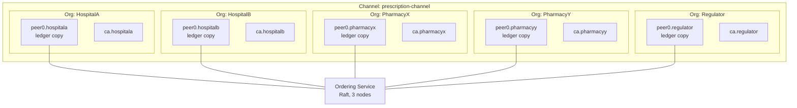
```mermaid
graph TB
    subgraph CH["Channel: prescription-channel"]
        direction TB

        subgraph H1["Org: HospitalA"]
            H1P[peer0.hospitala<br/>ledger copy]
            H1C[ca.hospitala]
        end

        subgraph H2["Org: HospitalB"]
            H2P[peer0.hospitalb<br/>ledger copy]
            H2C[ca.hospitalb]
        end

        subgraph P1["Org: PharmacyX"]
            P1P[peer0.pharmacyx<br/>ledger copy]
            P1C[ca.pharmacyx]
        end

        subgraph P2["Org: PharmacyY"]
            P2P[peer0.pharmacyy<br/>ledger copy]
            P2C[ca.pharmacyy]
        end

        subgraph RG["Org: Regulator"]
            RGP[peer0.regulator<br/>ledger copy]
            RGC[ca.regulator]
        end
    end

    ORD[Ordering Service<br/>Raft, 3 nodes]

    H1P --- ORD
    H2P --- ORD
    P1P --- ORD
    P2P --- ORD
    RGP --- ORD
```

### 2.1 Organization Roles

| Organization | MSP ID | Purpose | Endorses? |
|---|---|---|---|
| HospitalA | `HospitalAMSP` | Issues prescriptions | Yes |
| HospitalB | `HospitalBMSP` | Issues prescriptions | Yes |
| PharmacyX | `PharmacyXMSP` | Records fulfillments | Yes |
| PharmacyY | `PharmacyYMSP` | Records fulfillments | Yes |
| Regulator | `RegulatorMSP` | Read-only oversight | No (query only) |
| Orderer | `OrdererMSP` | Raft ordering service (`orderer1`–`orderer3`) | — |

**Hostnames.** Each peer org's domain is `<org>.example.com` (e.g. `peer0.hospitala.example.com`, `ca.hospitala.example.com`); orderers are `orderer1.example.com`–`orderer3.example.com`. `example.com` is reserved for documentation, so it never collides with a real domain. Node TLS certificates also carry `localhost` / `127.0.0.1` so host-side CLI tools can connect to published ports.

### 2.2 Endorsement Policy

```
AND(
  OR('HospitalAMSP.peer', 'HospitalBMSP.peer'),
  OR('PharmacyXMSP.peer', 'PharmacyYMSP.peer')
)
```

**Rationale:** Every state-changing transaction requires agreement from both sides of the trust boundary. A hospital cannot commit a prescription without a pharmacy independently validating it, and a pharmacy cannot commit a fulfillment without a hospital peer independently confirming the underlying prescription and fraud rules. This is the structural property that makes unilateral fraud impossible.

> The `.peer` role in this policy only resolves when **NodeOUs** are enabled for every org (`EnableNodeOUs: true` in `crypto-config.yaml`, which writes `msp/config.yaml`). Without NodeOUs every endorsement fails the policy.

### 2.3 Identity Architecture

Two tools issue certificates, and they must share one root of trust per organization:

| Identity | Issued by | Why |
|---|---|---|
| Peers, orderers, org admins | `cryptogen` (Phase 1) | Static, generated before any container runs |
| Doctors, pharmacists, auditor | Fabric CA (Phase 3) | Needs the `role` attribute embedded in the certificate |

Each org's `fabric-ca-server` is started **with that org's cryptogen CA certificate and private key** (`FABRIC_CA_SERVER_CA_CERTFILE` / `FABRIC_CA_SERVER_CA_KEYFILE` → `organizations/peerOrganizations/<org>/ca/`). User certificates therefore chain to the same root that the channel configuration lists in the org's MSP, and the network accepts them as members.

> If the CA instead generated its own root, every enrolled user would be rejected as an unknown identity — the channel only trusts the roots in its MSP definitions.

### 2.4 Channel Creation

Fabric 2.5 creates channels through the **channel participation API**; there is no orderer system channel (it is deprecated in 2.x and removed in 3.x):

1. `configtxgen -outputBlock` writes the genesis block of `prescription-channel` directly, including each org's anchor peer.
2. `osnadmin channel join` hands that block to each orderer (orderers start with `ORDERER_GENERAL_BOOTSTRAPMETHOD=none`).
3. `peer channel join -b` joins each peer.

---

## 3. High-Level Design

### 3.1 Component Diagram

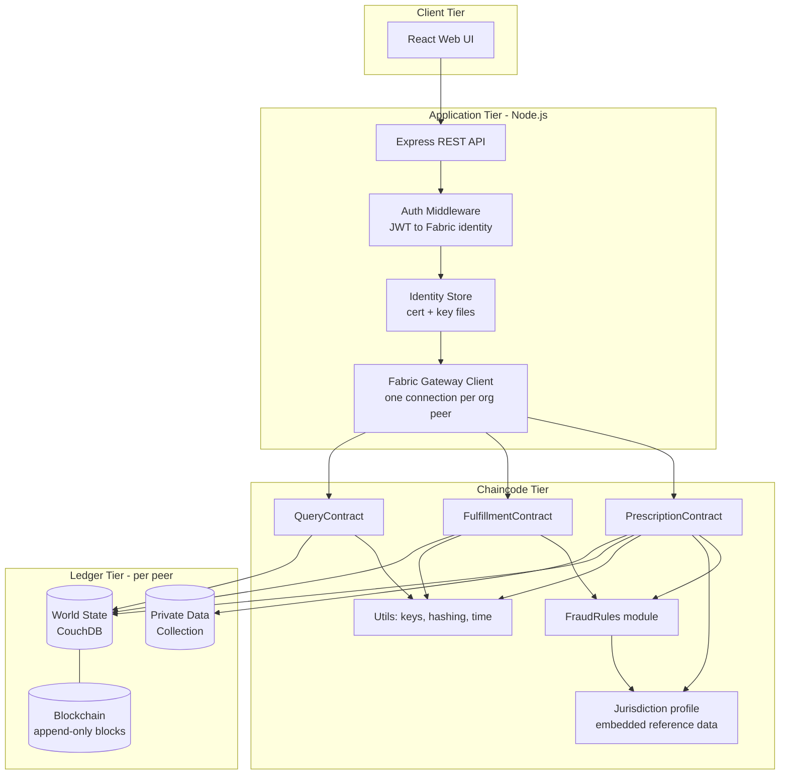
```mermaid
graph TB
    subgraph Client["Client Tier"]
        WUI[React Web UI]
    end

    subgraph App["Application Tier - Node.js"]
        REST[Express REST API]
        AUTH[Auth Middleware<br/>JWT to Fabric identity]
        WALLET[Identity Store<br/>cert + key files]
        GW[Fabric Gateway Client<br/>one connection per org peer]
    end

    subgraph Chain["Chaincode Tier"]
        PC[PrescriptionContract]
        FC[FulfillmentContract]
        QC[QueryContract]
        FR[FraudRules module]
        REF[Jurisdiction profile<br/>embedded reference data]
        UT[Utils: keys, hashing, time]
    end

    subgraph Ledger["Ledger Tier - per peer"]
        BC[(Blockchain<br/>append-only blocks)]
        WS[(World State<br/>CouchDB)]
        PDC[(Private Data<br/>Collection)]
    end

    WUI --> REST
    REST --> AUTH
    AUTH --> WALLET
    WALLET --> GW
    GW --> PC
    GW --> FC
    GW --> QC
    PC --> FR
    FC --> FR
    FR --> REF
    PC --> REF
    PC --> UT
    FC --> UT
    QC --> UT
    PC --> WS
    FC --> WS
    QC --> WS
    PC --> PDC
    WS --- BC
```

### 3.2 Layer Responsibilities

| Component | Responsibility | Must NOT do |
|---|---|---|
| Web UI | Render role-appropriate forms and views | Contain business rules |
| REST API | Map HTTP to chaincode invocations, manage sessions | Validate fraud rules |
| Identity store | Load each enrolled user's X.509 certificate and private key from its MSP directory (`@hyperledger/fabric-gateway` has no wallet object) | Generate identities at request time |
| Chaincode | Enforce **all** business and fraud rules | Perform non-deterministic operations |
| World State | Serve current-value queries | Be treated as authoritative over the blockchain |

> **Critical placement rule:** Fraud rules live in chaincode only. If a rule is enforced in the REST API, a malicious organization can bypass it by invoking chaincode directly with its own client. The API layer may duplicate checks for user experience, but chaincode is the enforcement point.

---

## 4. Low-Level Design

### 4.1 Ledger Key Schema

Composite keys allow prefix-range queries without relying on CouchDB indexes for core operations.

| Entity | Key format | Example |
|---|---|---|
| Prescription | `PRESC~{prescriptionId}` | `PRESC~a3f1c9e2-...` |
| Fulfillment | `FULFILL~{prescriptionId}~{sequence}` | `FULFILL~a3f1c9e2-...~0` |
| Revocation | `REVOKE~{prescriptionId}` | `REVOKE~a3f1c9e2-...` |
| Doctor index | `DOCIDX~{doctorMSP}~{doctorId}~{prescriptionId}` | For "my prescriptions" queries; MSP included because common names are unique only within an org |

Retrieving all fulfillments for a prescription is a partial composite key range query on `FULFILL~{prescriptionId}~`, which is deterministic and index-free.

### 4.2 Data Model

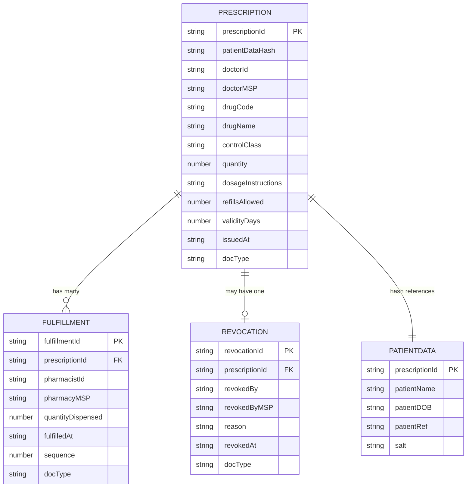
```mermaid
erDiagram
    PRESCRIPTION ||--o{ FULFILLMENT : "has many"
    PRESCRIPTION ||--o| REVOCATION : "may have one"
    PRESCRIPTION ||--|| PATIENTDATA : "hash references"

    PRESCRIPTION {
        string prescriptionId PK
        string patientDataHash
        string doctorId
        string doctorMSP
        string drugCode
        string drugName
        string controlClass
        number quantity
        string dosageInstructions
        number refillsAllowed
        number validityDays
        string issuedAt
        string docType
    }

    FULFILLMENT {
        string fulfillmentId PK
        string prescriptionId FK
        string pharmacistId
        string pharmacyMSP
        number quantityDispensed
        string fulfilledAt
        number sequence
        string docType
    }

    REVOCATION {
        string revocationId PK
        string prescriptionId FK
        string revokedBy
        string revokedByMSP
        string reason
        string revokedAt
        string docType
    }

    PATIENTDATA {
        string prescriptionId PK
        string patientName
        string patientDOB
        string patientRef
        string salt
    }
```

**Note the absence of a `status` field.** This is deliberate and load-bearing. See §4.4.

### 4.3 Chaincode Function Signatures

```
// PrescriptionContract
IssuePrescription(ctx, prescriptionId, drugCode,
                  quantity, dosageInstructions, refillsAllowed, validityDays)
    → drugName and controlClass are looked up from the jurisdiction profile
    → transient map carries: patientName, patientDOB, patientRef, salt
RevokePrescription(ctx, prescriptionId, reason)
ReadPrescription(ctx, prescriptionId)
ReadPatientData(ctx, prescriptionId)              // private collection

// FulfillmentContract
RecordFulfillment(ctx, prescriptionId, quantityDispensed)
GetFulfillments(ctx, prescriptionId)

// QueryContract
GetPrescriptionStatus(ctx, prescriptionId)        // derived, never stored
GetPrescriptionHistory(ctx, prescriptionId)       // full tx history, audit
GetPrescriptionsByDoctor(ctx, doctorMSP, doctorId)
CheckFulfillmentEligibility(ctx, prescriptionId, quantityRequested)
GetDrugReference(ctx)                              // jurisdiction profile, for UI dropdowns
```

`GetPrescriptionHistory` returns what `GetHistoryForKey` provides — transaction ID, timestamp, value per write. Endorsing organizations are not part of key history; the API reads them per transaction ID from the `qscc` system chaincode (`GetTransactionByID`) for the regulator view.

Patient-identifying fields are passed via the **transient data map**, not as ordinary arguments. Ordinary arguments are written into the transaction proposal and therefore onto the blockchain of every org; transient data is not.

### 4.4 Status Derivation Algorithm

```
function GetPrescriptionStatus(prescriptionId):
    prescription ← getState(PRESC~prescriptionId)
    if prescription is null: throw NotFound

    revocation ← getState(REVOKE~prescriptionId)
    if revocation exists: return REVOKED

    fulfillments ← getStateByPartialCompositeKey(FULFILL~prescriptionId~)
    maxDispenses ← prescription.refillsAllowed + 1

    if count(fulfillments) ≥ maxDispenses:
        return FULLY_FULFILLED

    now ← txTimestamp
    expiry ← prescription.issuedAt + prescription.validityDays
    if now > expiry:
        return EXPIRED

    if count(fulfillments) == 0:
        return ISSUED
    else:
        return PARTIALLY_FULFILLED
```

**Ordering matters.** `REVOKED` precedes all others. `FULLY_FULFILLED` is evaluated before `EXPIRED` so that a completed prescription does not later appear expired.

### 4.5 Fraud Rule Evaluation Order

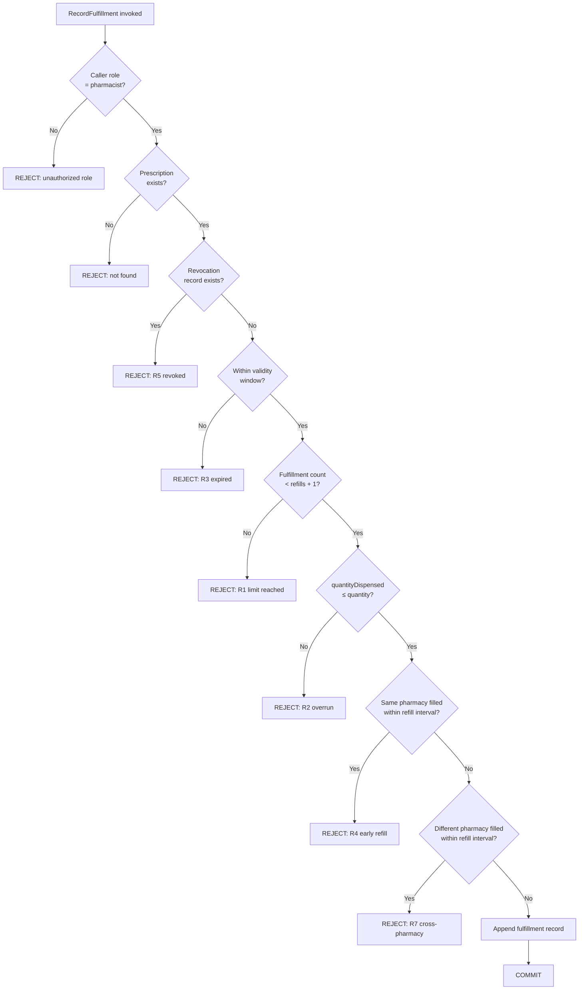
```mermaid
flowchart TD
    A[RecordFulfillment invoked] --> B{Caller role<br/>= pharmacist?}
    B -->|No| Z[REJECT: unauthorized role]
    B -->|Yes| C{Prescription<br/>exists?}
    C -->|No| Y[REJECT: not found]
    C -->|Yes| D{Revocation<br/>record exists?}
    D -->|Yes| X[REJECT: R5 revoked]
    D -->|No| E{Within validity<br/>window?}
    E -->|No| W[REJECT: R3 expired]
    E -->|Yes| F{Fulfillment count<br/>< refills + 1?}
    F -->|No| V[REJECT: R1 limit reached]
    F -->|Yes| G{quantityDispensed<br/>≤ quantity?}
    G -->|No| U[REJECT: R2 overrun]
    G -->|Yes| H{Same pharmacy filled<br/>within refill interval?}
    H -->|Yes| T[REJECT: R4 early refill]
    H -->|No| I{Different pharmacy filled<br/>within refill interval?}
    I -->|Yes| S[REJECT: R7 cross-pharmacy]
    I -->|No| J[Append fulfillment record]
    J --> K[COMMIT]
```

The refill interval is the control class's `minRefillIntervalDays` (§4.6), measured against the most recent fulfillment. R4 and R7 split on whether that fulfillment came from the caller's pharmacy MSP, so both are reachable. Because R1 runs first, a duplicate fill on a **zero-refill** prescription always reports R1, even across pharmacies; R7 is observed only on prescriptions with refills remaining.

### 4.6 Jurisdiction Profile

The profile (control classes with `maxRefills` / `minRefillIntervalDays`, plus the drug reference list — `spec.md` §7.5) lives in `chaincode/medledger/reference/profile.json` and is compiled in with Go's `//go:embed`. It is never read from the peer filesystem or environment at runtime (NFR-7): every peer runs the identical embedded bytes. The India profile is the default; a different country is a different `profile.json` and a chaincode upgrade.

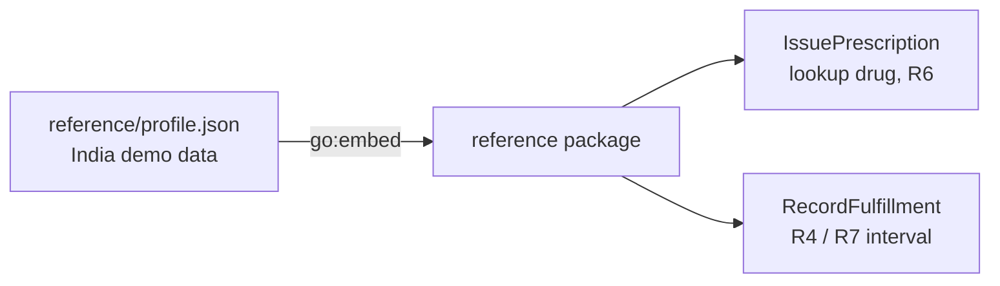
```mermaid
graph LR
    PJ[reference/profile.json<br/>India demo data] -->|go:embed| RF[reference package]
    RF --> ISS[IssuePrescription<br/>lookup drug, R6]
    RF --> FUL[RecordFulfillment<br/>R4 / R7 interval]
```

---

## 5. Transaction Flows

### 5.1 Prescription Issuance

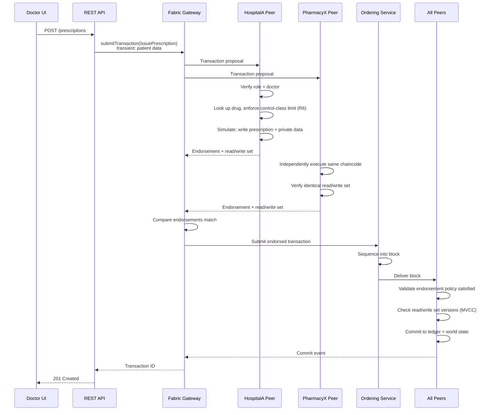
```mermaid
sequenceDiagram
    participant Dr as Doctor UI
    participant API as REST API
    participant GW as Fabric Gateway
    participant HP as HospitalA Peer
    participant PP as PharmacyX Peer
    participant ORD as Ordering Service
    participant ALL as All Peers

    Dr->>API: POST /prescriptions
    API->>GW: submitTransaction(IssuePrescription)<br/>transient: patient data
    GW->>HP: Transaction proposal
    GW->>PP: Transaction proposal

    HP->>HP: Verify role = doctor
    HP->>HP: Look up drug, enforce control-class limit (R6)
    HP->>HP: Simulate: write prescription + private data
    HP-->>GW: Endorsement + read/write set

    PP->>PP: Independently execute same chaincode
    PP->>PP: Verify identical read/write set
    PP-->>GW: Endorsement + read/write set

    GW->>GW: Compare endorsements match
    GW->>ORD: Submit endorsed transaction
    ORD->>ORD: Sequence into block
    ORD->>ALL: Deliver block

    ALL->>ALL: Validate endorsement policy satisfied
    ALL->>ALL: Check read/write set versions (MVCC)
    ALL->>ALL: Commit to ledger + world state
    ALL-->>GW: Commit event
    GW-->>API: Transaction ID
    API-->>Dr: 201 Created
```

### 5.2 Fulfillment Recording

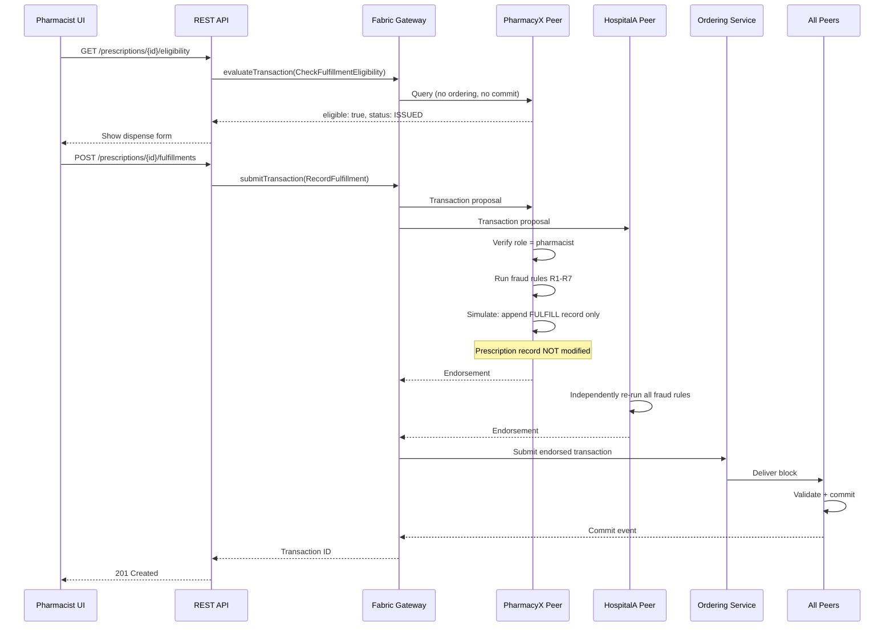
```mermaid
sequenceDiagram
    participant Ph as Pharmacist UI
    participant API as REST API
    participant GW as Fabric Gateway
    participant PP as PharmacyX Peer
    participant HP as HospitalA Peer
    participant ORD as Ordering Service
    participant ALL as All Peers

    Ph->>API: GET /prescriptions/{id}/eligibility
    API->>GW: evaluateTransaction(CheckFulfillmentEligibility)
    GW->>PP: Query (no ordering, no commit)
    PP-->>API: eligible: true, status: ISSUED
    API-->>Ph: Show dispense form

    Ph->>API: POST /prescriptions/{id}/fulfillments
    API->>GW: submitTransaction(RecordFulfillment)
    GW->>PP: Transaction proposal
    GW->>HP: Transaction proposal

    PP->>PP: Verify role = pharmacist
    PP->>PP: Run fraud rules R1-R7
    PP->>PP: Simulate: append FULFILL record only
    Note over PP: Prescription record NOT modified
    PP-->>GW: Endorsement

    HP->>HP: Independently re-run all fraud rules
    HP-->>GW: Endorsement

    GW->>ORD: Submit endorsed transaction
    ORD->>ALL: Deliver block
    ALL->>ALL: Validate + commit
    ALL-->>GW: Commit event
    GW-->>API: Transaction ID
    API-->>Ph: 201 Created
```

### 5.3 Fraud Attempt — Duplicate Fulfillment at a Second Pharmacy

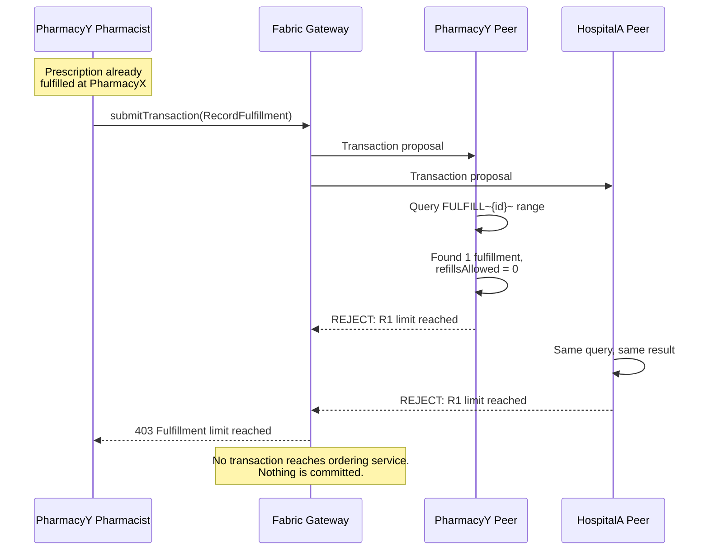
```mermaid
sequenceDiagram
    participant PhY as PharmacyY Pharmacist
    participant GW as Fabric Gateway
    participant PYP as PharmacyY Peer
    participant HP as HospitalA Peer

    Note over PhY: Prescription already<br/>fulfilled at PharmacyX
    PhY->>GW: submitTransaction(RecordFulfillment)
    GW->>PYP: Transaction proposal
    GW->>HP: Transaction proposal

    PYP->>PYP: Query FULFILL~{id}~ range
    PYP->>PYP: Found 1 fulfillment,<br/>refillsAllowed = 0
    PYP-->>GW: REJECT: R1 limit reached

    HP->>HP: Same query, same result
    HP-->>GW: REJECT: R1 limit reached

    GW-->>PhY: 403 Fulfillment limit reached
    Note over GW: No transaction reaches ordering service.<br/>Nothing is committed.
```

**This is the core demonstration.** PharmacyY cannot fulfill even though it never saw the original dispense — because it holds the same ledger, and because HospitalA's peer independently reached the same conclusion.

---

## 6. Technology Stack

| Layer | Technology | Version target | Rationale |
|---|---|---|---|
| Blockchain framework | Hyperledger Fabric | 2.5.16 (2.5 LTS line) | Permissioned, pluggable consensus, private data support |
| Consensus | Raft (etcdraft) | Built-in | Crash-fault tolerant, production default for Fabric 2.x |
| Channel capabilities | Channel / Orderer / Application | `V2_0` / `V2_0` / `V2_5` | Application `V2_5` enables 2.5 features (e.g. private data purge) |
| Chaincode language | **Go** | `go 1.24.0` in `go.mod` | Best-supported chaincode language; strong typing catches determinism bugs at compile time |
| Chaincode SDK | `fabric-contract-api-go/v2` | 2.2.1 (pinned) | Official contract API |
| State database | CouchDB | 3.3.3 | Rich JSON queries for audit views; version paired with Fabric 2.5 samples |
| Application runtime | Node.js | 22 LTS | Supported until April 2027 (Node 20 reached end of life April 2026) |
| Application SDK | `@hyperledger/fabric-gateway` | 1.12+ | Modern gateway API, replaces legacy `fabric-network` |
| REST framework | Express | 5.x | Minimal, well-understood; native async error handling |
| Web UI | React + Vite | 19 / 8 | Fast dev loop |
| UI styling | Tailwind CSS | 4.x (`@tailwindcss/vite`) | Rapid role-specific layouts; no PostCSS config |
| Containerization | Docker + Docker Compose | 24+ / v2 | Standard Fabric test-network approach |
| Certificate authority | Fabric CA | 1.5.22 | Per-org identity issuance |
| Testing | Go `testing` + `testify`; Jest 30 for API | — | Unit tests for chaincode rules |

> **Go version pinning.** Peers compile Go chaincode inside the `hyperledger/fabric-ccenv:2.5.16` image (Go 1.26.4), not with the host's Go. The `go` directive in `go.mod` must never exceed that image's Go version (check with `docker run --rm hyperledger/fabric-ccenv:2.5.16 go version`). Dependencies raise the minimum: `fabric-contract-api-go/v2` v2.2.1 requires Go 1.24.0, v2.2.2 requires 1.25.0, and v2.2.3 requires **1.26.7 — newer than ccenv 2.5.16, so it cannot be used**. Pin v2.2.1 (`go 1.24.0`), which builds on the host (Go 1.24+) and in ccenv. Omit the `toolchain` line (`go mod edit -toolchain=none`) so no toolchain download is attempted. Re-check this table before bumping either Fabric or the contract API.

### 6.1 Language Choice Note

Chaincode is specified in **Go** rather than JavaScript. Fabric's Go contract API is the most mature, and Go's explicit error handling and absence of implicit type coercion reduce the risk of non-deterministic endorsement failures (NFR-7). The application tier is plain JavaScript on Node.js (no TypeScript build step, per `CONSTITUTION.md`), so the project is bilingual: Go for the contract, JavaScript for everything above it.

### 6.2 Supported Demo Hosts

| Host | Docker | Notes |
|---|---|---|
| openSUSE Leap 16.0 | Docker Engine from the distro repos | Leap 16 defaults to **SELinux** on fresh installs; systems upgraded from 15.x often keep AppArmor. The compose file sets `security_opt: [label=disable]` on every container, so bind mounts and the peers' Docker-socket access work under either, with no `:z` relabelling. |
| Ubuntu 24.04 on Windows 11 WSL2 | Docker Desktop (WSL integration) **or** Docker Engine installed inside WSL | Clone the repo inside the Linux filesystem (`~/…`), never under `/mnt/c` (slow, loses exec bits). `.gitattributes` forces LF on `*.sh`. WSL defaults to half the host RAM (8 GB on a 16 GB machine), which is sufficient; raise it via `%UserProfile%\.wslconfig` if needed. Ports published on `127.0.0.1` in WSL are reachable from Windows browsers. |

Fabric binaries and images are `linux/amd64` and identical on both hosts; the scripts use only `bash`, `jq`, `curl`, and Docker, so no host-specific branches are needed.

---

## 7. Private Data Design

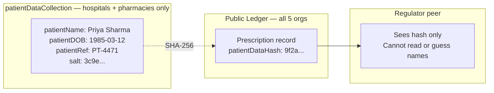
```mermaid
graph LR
    subgraph Public["Public Ledger — all 5 orgs"]
        PUB[Prescription record<br/>patientDataHash: 9f2a...]
    end

    subgraph Private["patientDataCollection — hospitals + pharmacies only"]
        PRIV[patientName: Priya Sharma<br/>patientDOB: 1985-03-12<br/>patientRef: PT-4471<br/>salt: 3c9e...]
    end

    subgraph Excluded["Regulator peer"]
        EX[Sees hash only<br/>Cannot read or guess names]
    end

    PRIV -.->|SHA-256| PUB
    PUB --> EX
```

**Collection definition (`collections_config.json`):**

| Property | Value |
|---|---|
| `name` | `patientDataCollection` |
| `policy` | `OR('HospitalAMSP.member','HospitalBMSP.member','PharmacyXMSP.member','PharmacyYMSP.member')` |
| `requiredPeerCount` | 1 |
| `maxPeerCount` | 3 |
| `blockToLive` | 0 (retain indefinitely) |
| `memberOnlyRead` | true |
| `memberOnlyWrite` | true |

The hash on the public ledger still provides tamper evidence: anyone can verify that private data matching a given hash existed at a given block height, without seeing its contents.

**Why the salt.** Names and birth dates have low entropy; an unsalted SHA-256 of them could be reversed by hashing candidate combinations. The API generates a random 32-byte salt per prescription (Node `crypto.randomBytes`) and sends it in the transient map. Chaincode rejects a missing or short salt but does **not** generate one — randomness inside chaincode would break determinism (NFR-7). The hash is computed over the canonical JSON of the private payload (fields in the fixed order of `spec.md` §7.4).

---

## 8. Deployment Architecture

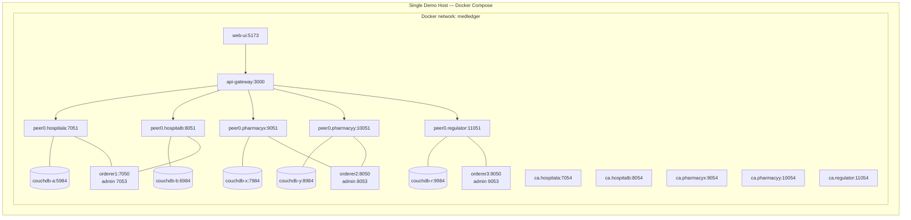
```mermaid
graph TB
    subgraph Host["Single Demo Host — Docker Compose"]
        subgraph Net["Docker network: medledger"]
            O1[orderer1:7050<br/>admin 7053]
            O2[orderer2:8050<br/>admin 8053]
            O3[orderer3:9050<br/>admin 9053]

            PA[peer0.hospitala:7051]
            PB[peer0.hospitalb:8051]
            PX[peer0.pharmacyx:9051]
            PY[peer0.pharmacyy:10051]
            PR[peer0.regulator:11051]

            CA1[ca.hospitala:7054]
            CA2[ca.hospitalb:8054]
            CA3[ca.pharmacyx:9054]
            CA4[ca.pharmacyy:10054]
            CA5[ca.regulator:11054]

            DBA[(couchdb-a:5984)]
            DBB[(couchdb-b:6984)]
            DBX[(couchdb-x:7984)]
            DBY[(couchdb-y:8984)]
            DBR[(couchdb-r:9984)]

            API[api-gateway:3000]
            WEB[web-ui:5173]
        end
    end

    PA --- DBA
    PB --- DBB
    PX --- DBX
    PY --- DBY
    PR --- DBR

    PA --- O1
    PB --- O1
    PX --- O2
    PY --- O2
    PR --- O3

    API --> PA
    API --> PB
    API --> PX
    API --> PY
    API --> PR
    WEB --> API
```

**Deployment notes**

- The API opens one gRPC connection per org peer and submits each user's transactions through **their own org's peer**, as Fabric Gateway expects. The gateway peer then collects the other endorsements the policy needs.
- Every published port binds to `127.0.0.1` (e.g. `"127.0.0.1:5984:5984"`); nothing is exposed beyond the demo host.
- Peers mount `/var/run/docker.sock` so they can build and launch chaincode containers.
- Every container runs with `security_opt: [label=disable]` (SELinux hosts, §6.2).
- Ledger, CA, and CouchDB data live in Docker volumes, never in the repository; `down.sh` deletes them.
- Each `ca.<org>` container mounts its org's cryptogen `ca/` directory and uses it as its signing root (§2.3).
- Orderers start with `ORDERER_GENERAL_BOOTSTRAPMETHOD=none` and `ORDERER_CHANNELPARTICIPATION_ENABLED=true`; ports 7053/8053/9053 serve the `osnadmin` admin API over mutual TLS.

---

## 9. Repository Structure

```
medledger/
├── README.md
├── CONSTITUTION.md
├── run-demo.sh
├── docs/
│   ├── spec.md
│   ├── design.md
│   └── plan.md
├── network/
│   ├── docker-compose.yaml
│   ├── configtx.yaml
│   ├── crypto-config.yaml
│   ├── collections_config.json
│   └── scripts/
│       ├── common.sh            # shared org/port settings, sourced by the others
│       ├── generateArtifacts.sh
│       ├── up.sh
│       ├── down.sh
│       ├── createChannel.sh
│       ├── deployChaincode.sh
│       └── enrollUsers.sh
├── chaincode/
│   └── medledger/
│       ├── go.mod
│       ├── main.go
│       ├── contracts/
│       │   ├── prescription.go
│       │   ├── fulfillment.go
│       │   └── query.go
│       ├── models/
│       │   ├── prescription.go
│       │   ├── fulfillment.go
│       │   └── revocation.go
│       ├── rules/
│       │   └── fraud.go
│       ├── reference/
│       │   ├── profile.go          # go:embed loader
│       │   └── profile.json        # jurisdiction profile (India default)
│       ├── utils/
│       │   ├── keys.go
│       │   ├── identity.go
│       │   └── timestamp.go
│       └── contracts/*_test.go
├── api/
│   ├── package.json
│   ├── src/
│   │   ├── server.js
│   │   ├── gateway.js
│   │   ├── identities.js
│   │   ├── middleware/auth.js
│   │   └── routes/
│   │       ├── prescriptions.js
│   │       ├── fulfillments.js
│   │       └── audit.js
│   └── test/
├── web/
│   ├── package.json
│   └── src/
│       ├── App.jsx
│       └── views/
│           ├── DoctorView.jsx
│           ├── PharmacistView.jsx
│           └── RegulatorView.jsx
└── demo/
    ├── seed.sh
    └── fraud-scenarios.sh
```

---

## 10. Key Design Decisions

| # | Decision | Alternative rejected | Reason |
|---|---|---|---|
| D1 | Status derived at query time | Stored mutable `status` field | A pharmacy cannot modify a doctor-signed record without invalidating it; append-only ledgers have no update primitive |
| D2 | Endorsement policy spans hospital AND pharmacy | Single-org endorsement | Cross-boundary agreement is the entire point of using a blockchain here |
| D3 | Go for chaincode | JavaScript | Determinism safety; mature contract API |
| D4 | Patient data in private collection | Full patient data on ledger | Every org would otherwise hold PHI for every patient in the network |
| D5 | Transient data for patient fields | Regular chaincode arguments | Regular arguments are written to the blockchain of every org |
| D6 | Composite keys with range queries | CouchDB rich queries for core paths | Rich queries are not re-executed deterministically during validation |
| D7 | Fraud rules only in chaincode | Duplicated in API as enforcement | API can be bypassed by direct chaincode invocation |
| D8 | Regulator excluded from private collection | Regulator included | Demonstrates data minimization; regulator can be granted access via governance if needed |
| D9 | Fabric CA signs with the cryptogen CA key per org | Separate CA roots; or Fabric CA for all identities | One root of trust per org with the least setup; cryptogen stays for static node identities |
| D10 | Channel participation API (`osnadmin`) | Orderer system channel | System channel is deprecated in 2.5 and removed in 3.x |
| D11 | Generic control classes + embedded jurisdiction profile (India default) | Hard-coded US DEA schedules | Same rules serve any country; profile changes go through chaincode-upgrade governance |
| D12 | API-generated salt in private payload | Plain hash of patient fields | Prevents dictionary reversal of the public hash; randomness stays out of chaincode |
| D13 | R4/R7 split by same vs. different pharmacy | Two overlapping time windows | Makes both rules reachable and gives pharmacy shopping its own rule ID |

> **On D6:** CouchDB rich queries (`GetQueryResult`) are evaluated during simulation but **not** re-evaluated at validation time, so results can be stale by commit time. They are safe for read-only query functions, and unsafe inside functions that write state based on their results. Core fraud checks therefore use deterministic composite-key range queries.
