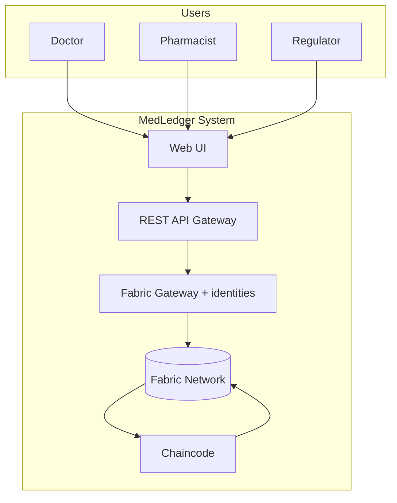
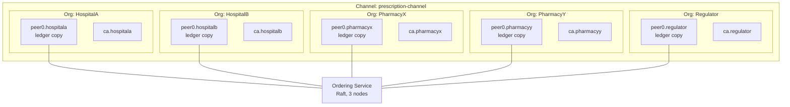
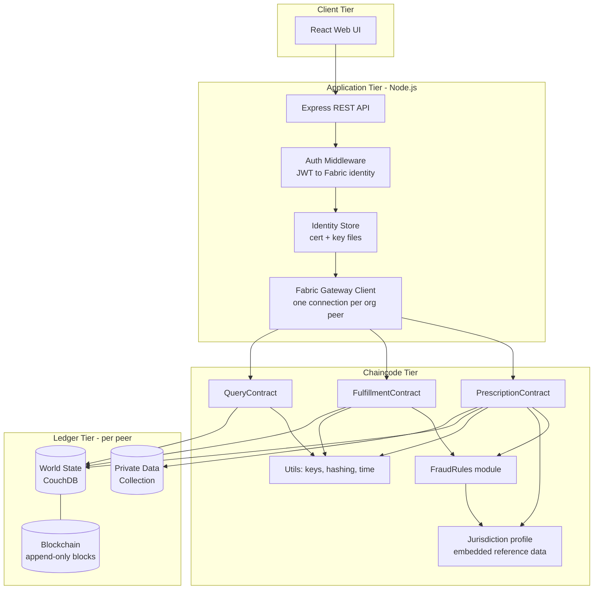
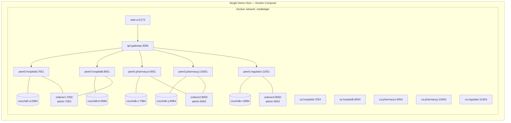

# Architecture — MedLedger

**Scope:** Organizations, network topology, identity and trust, channel, components, deployment, technology stack.
**Related:** [chaincode.md](chaincode.md) · [application.md](application.md) · [decisions](../decisions.md) · [glossary](../glossary.md) · [spec](../spec.md)

---

## Overview

MedLedger is a **permissioned consortium blockchain**. Five organizations participate, each running its own peer and certificate authority. No organization holds an authoritative copy of the data; all hold equal copies, and a record is only valid once the endorsement policy is satisfied across organizational boundaries.

The architecture is layered:

| Layer | Responsibility |
|---|---|
| **Presentation** | Role-specific web UI (doctor, pharmacist, regulator) |
| **Application** | REST API gateway; identity (cert + key) management; transaction submission |
| **Smart contract** | Chaincode enforcing all business and fraud rules |
| **Ledger** | Immutable blockchain + world state per peer |
| **Network** | Peers, ordering service, CAs, channel configuration |

### System Context



## Network Topology

Five organizations, one channel, one shared ledger.



## Organizations and Hostnames

| Organization | MSP ID | Purpose | Endorses? |
|---|---|---|---|
| HospitalA | `HospitalAMSP` | Issues prescriptions | Yes |
| HospitalB | `HospitalBMSP` | Issues prescriptions | Yes |
| PharmacyX | `PharmacyXMSP` | Records fulfillments | Yes |
| PharmacyY | `PharmacyYMSP` | Records fulfillments | Yes |
| Regulator | `RegulatorMSP` | Read-only oversight | No (query only) |
| Orderer | `OrdererMSP` | Raft ordering service (`orderer1`–`orderer3`) | — |

**Hostnames.** Each peer org's domain is `<org>.example.com` (e.g. `peer0.hospitala.example.com`, `ca.hospitala.example.com`); orderers are `orderer1.example.com`–`orderer3.example.com`. `example.com` is reserved for documentation, so it never collides with a real domain. Node TLS certificates also carry `localhost` / `127.0.0.1` so host-side CLI tools can connect to published ports.

## Endorsement Policy

```
AND(
  OR('HospitalAMSP.peer', 'HospitalBMSP.peer'),
  OR('PharmacyXMSP.peer', 'PharmacyYMSP.peer')
)
```

**Rationale:** Every state-changing transaction requires agreement from both sides of the trust boundary. A hospital cannot commit a prescription without a pharmacy independently validating it, and a pharmacy cannot commit a fulfillment without a hospital peer independently confirming the underlying prescription and fraud rules. This is the structural property that makes unilateral fraud impossible.

> The `.peer` role in this policy only resolves when **NodeOUs** are enabled for every org (`EnableNodeOUs: true` in `crypto-config.yaml`, which writes `msp/config.yaml`). Without NodeOUs every endorsement fails the policy.

## Identity and CA Trust

Two tools issue certificates, and they must share one root of trust per organization:

| Identity | Issued by | Why |
|---|---|---|
| Peers, orderers, org admins | `cryptogen` (Phase 1) | Static, generated before any container runs |
| Doctors, pharmacists, auditor | Fabric CA (Phase 3) | Needs the `role` attribute embedded in the certificate |

Each org's `fabric-ca-server` is started **with that org's cryptogen CA certificate and private key** (`FABRIC_CA_SERVER_CA_CERTFILE` / `FABRIC_CA_SERVER_CA_KEYFILE` → `organizations/peerOrganizations/<org>/ca/`). User certificates therefore chain to the same root that the channel configuration lists in the org's MSP, and the network accepts them as members.

> If the CA instead generated its own root, every enrolled user would be rejected as an unknown identity — the channel only trusts the roots in its MSP definitions.

## Channel Creation

Fabric 2.5 creates channels through the **channel participation API**; there is no orderer system channel (it is deprecated in 2.x and removed in 3.x):

1. `configtxgen -outputBlock` writes the genesis block of `prescription-channel` directly, including each org's anchor peer.
2. `osnadmin channel join` hands that block to each orderer (orderers start with `ORDERER_GENERAL_BOOTSTRAPMETHOD=none`).
3. `peer channel join -b` joins each peer.

## Components



### Layer Responsibilities

| Component | Responsibility | Must NOT do |
|---|---|---|
| Web UI | Render role-appropriate forms and views | Contain business rules |
| REST API | Map HTTP to chaincode invocations, manage sessions | Validate fraud rules |
| Identity store | Load each enrolled user's X.509 certificate and private key from its MSP directory (`@hyperledger/fabric-gateway` has no wallet object) | Generate identities at request time |
| Chaincode | Enforce **all** business and fraud rules | Perform non-deterministic operations |
| World State | Serve current-value queries | Be treated as authoritative over the blockchain |

> **Critical placement rule:** Fraud rules live in chaincode only. If a rule is enforced in the REST API, a malicious organization can bypass it by invoking chaincode directly with its own client. The API layer may duplicate checks for user experience, but chaincode is the enforcement point.

## Deployment



**Deployment notes**

- The API opens one gRPC connection per org peer and submits each user's transactions through **their own org's peer**, as Fabric Gateway expects. The gateway peer then collects the other endorsements the policy needs.
- Every published port binds to `127.0.0.1` (e.g. `"127.0.0.1:5984:5984"`); nothing is exposed beyond the demo host.
- Peers mount `/var/run/docker.sock` so they can build and launch chaincode containers.
- Every container runs with `security_opt: [label=disable]` (SELinux hosts — see [runbook](../runbook.md#supported-hosts)).
- Ledger, CA, and CouchDB data live in Docker volumes, never in the repository; `down.sh` deletes them.
- Each `ca.<org>` container mounts its org's cryptogen `ca/` directory and uses it as its signing root ([Identity and CA Trust](#identity-and-ca-trust)).
- Orderers start with `ORDERER_GENERAL_BOOTSTRAPMETHOD=none` and `ORDERER_CHANNELPARTICIPATION_ENABLED=true`; ports 7053/8053/9053 serve the `osnadmin` admin API over mutual TLS.

Published ports and credentials are listed in the [runbook](../runbook.md#services-ports-and-credentials).

## Technology Stack and Versions

This table is the single source of truth for pinned versions.

| Layer | Technology | Version target | Rationale |
|---|---|---|---|
| Blockchain framework | Hyperledger Fabric | 2.5.16 (2.5 LTS line) | Permissioned, pluggable consensus, private data support |
| Consensus | Raft (etcdraft) | Built-in | Crash-fault tolerant, production default for Fabric 2.x |
| Channel capabilities | Channel / Orderer / Application | `V2_0` / `V2_0` / `V2_5` | Application `V2_5` enables 2.5 features (e.g. private data purge) |
| Chaincode language | **Go** | `go 1.24.0` in `go.mod` | Best-supported chaincode language; strong typing catches determinism bugs at compile time |
| Chaincode SDK | `fabric-contract-api-go/v2` | 2.2.1 (pinned) | Official contract API |
| State database | CouchDB | 3.3.3 | Rich JSON queries for audit views; version paired with Fabric 2.5 samples |
| Application runtime | Node.js | 22 LTS | Supported until April 2027 (Node 20 reached end of life April 2026) |
| Application SDK | `@hyperledger/fabric-gateway` | 1.12+ | Modern gateway API, replaces legacy `fabric-network` |
| REST framework | Express | 5.x | Minimal, well-understood; native async error handling |
| Web UI | React + Vite | 19 / 8 | Fast dev loop |
| UI styling | Tailwind CSS | 4.x (`@tailwindcss/vite`) | Rapid role-specific layouts; no PostCSS config |
| Containerization | Docker + Docker Compose | 24+ / v2 | Standard Fabric test-network approach |
| Certificate authority | Fabric CA | 1.5.22 | Per-org identity issuance |
| Testing | Go `testing` + `testify`; Jest 30 for API | — | Unit tests for chaincode rules |

> **Go version pinning.** Peers compile Go chaincode inside the `hyperledger/fabric-ccenv:2.5.16` image (Go 1.26.4), not with the host's Go. The `go` directive in `go.mod` must never exceed that image's Go version (check with `docker run --rm hyperledger/fabric-ccenv:2.5.16 go version`). Dependencies raise the minimum: `fabric-contract-api-go/v2` v2.2.1 requires Go 1.24.0, v2.2.2 requires 1.25.0, and v2.2.3 requires **1.26.7 — newer than ccenv 2.5.16, so it cannot be used**. Pin v2.2.1 (`go 1.24.0`), which builds on the host (Go 1.24+) and in ccenv. Omit the `toolchain` line (`go mod edit -toolchain=none`) so no toolchain download is attempted. Re-check this table before bumping either Fabric or the contract API.

### Language Choice

Chaincode is specified in **Go** rather than JavaScript. Fabric's Go contract API is the most mature, and Go's explicit error handling and absence of implicit type coercion reduce the risk of non-deterministic endorsement failures (NFR-7). The application tier is plain JavaScript on Node.js (no TypeScript build step, per `CONSTITUTION.md`), so the project is bilingual: Go for the contract, JavaScript for everything above it.
