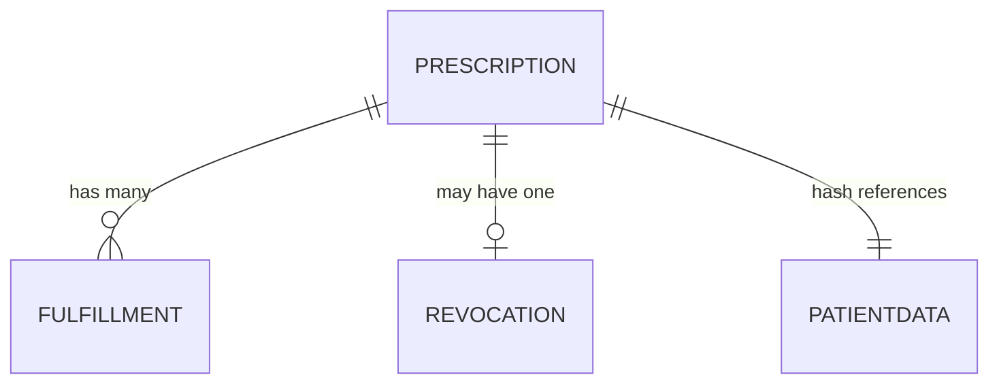
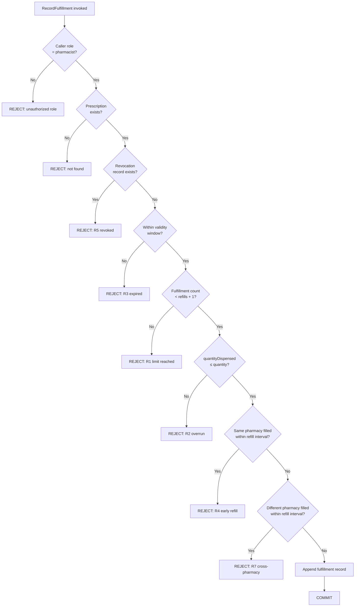
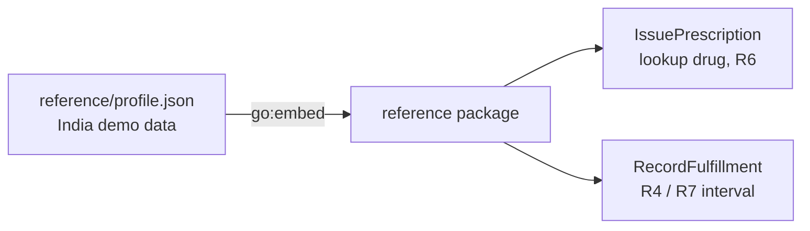
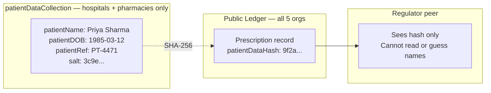
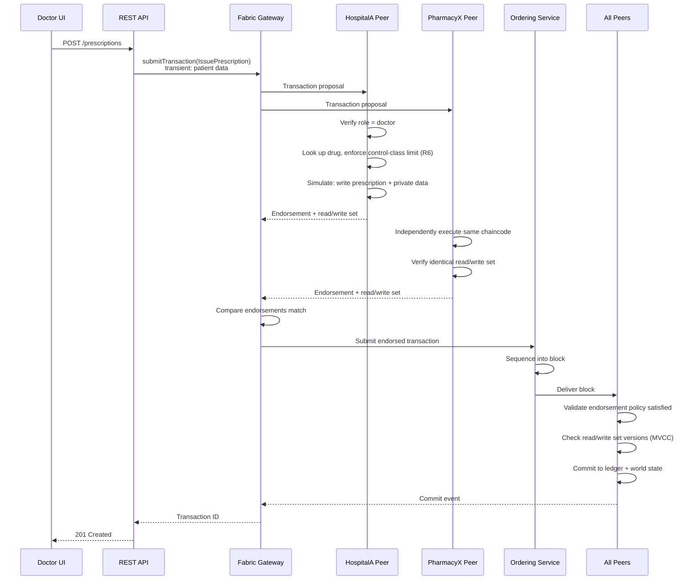
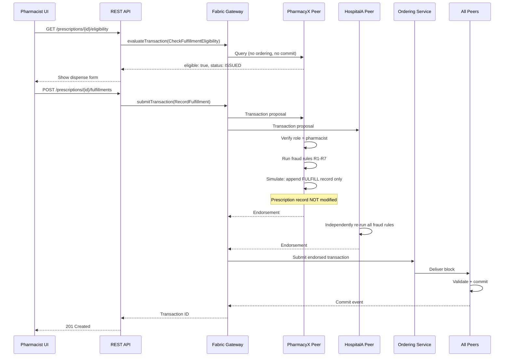
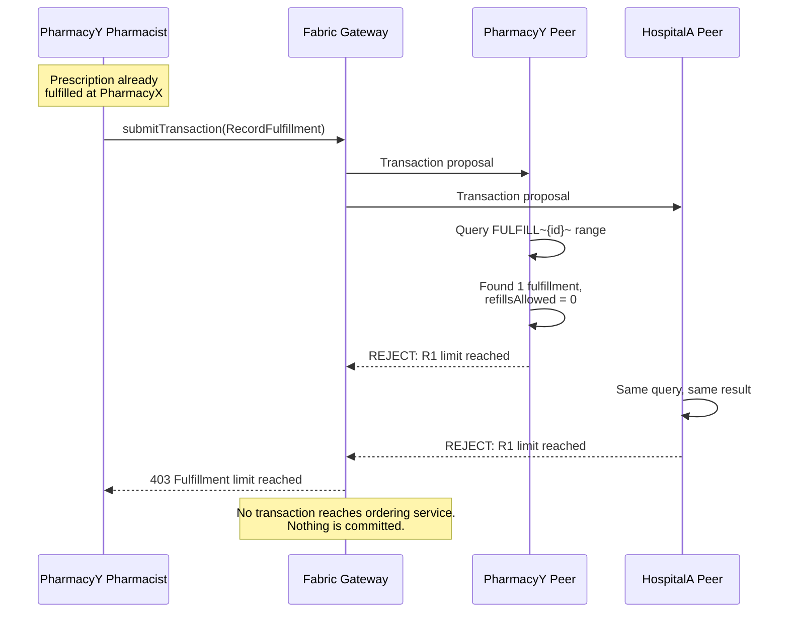

# Chaincode Design — MedLedger

**Scope:** Ledger keys, contract functions and their rules, status derivation, fraud-rule order, jurisdiction profile, private data, transaction flows.
**Related:** [architecture.md](architecture.md) · [application.md](application.md) · [spec](../spec.md) · [decisions](../decisions.md)

---

## Ledger Key Schema

Composite keys allow prefix-range queries without relying on CouchDB indexes for core operations.

| Entity | Key format | Example |
|---|---|---|
| Prescription | `PRESC~{prescriptionId}` | `PRESC~a3f1c9e2-...` |
| Fulfillment | `FULFILL~{prescriptionId}~{sequence}` | `FULFILL~a3f1c9e2-...~0` |
| Revocation | `REVOKE~{prescriptionId}` | `REVOKE~a3f1c9e2-...` |
| Doctor index | `DOCIDX~{doctorMSP}~{doctorId}~{prescriptionId}` | For "my prescriptions" queries; MSP included because common names are unique only within an org |

Retrieving all fulfillments for a prescription is a partial composite key range query on `FULFILL~{prescriptionId}~`, which is deterministic and index-free.

## Data Model

Entity relationships. Field-level definitions live in the [spec's Data Specification](../spec.md#data-specification); they are not repeated here.



**Note the absence of a `status` field on PRESCRIPTION.** This is deliberate and load-bearing. See [Status Derivation](#status-derivation).

## Contract Functions

```
// PrescriptionContract
IssuePrescription(ctx, prescriptionId, drugCode,
                  quantity, dosageInstructions, refillsAllowed, validityDays)
    → drugName and controlClass are looked up from the jurisdiction profile
    → transient map carries: patientName, patientDOB, patientRef, salt
RevokePrescription(ctx, prescriptionId, reason)
ReadPrescription(ctx, prescriptionId)
ReadPatientData(ctx, prescriptionId)              // private collection

// FulfillmentContract
RecordFulfillment(ctx, prescriptionId, quantityDispensed)
GetFulfillments(ctx, prescriptionId)

// QueryContract
GetPrescriptionStatus(ctx, prescriptionId)        // derived, never stored
GetPrescriptionHistory(ctx, prescriptionId)       // full tx history, audit
GetPrescriptionsByDoctor(ctx, doctorMSP, doctorId)
CheckFulfillmentEligibility(ctx, prescriptionId, quantityRequested)
GetDrugReference(ctx)                              // jurisdiction profile, for UI dropdowns
```

`GetPrescriptionHistory` returns what `GetHistoryForKey` provides — transaction ID, timestamp, value per write. Endorsing organizations are not part of key history; the API reads them per transaction ID from the `qscc` system chaincode (`GetTransactionByID`) for the regulator view.

Patient-identifying fields are passed via the **transient data map**, not as ordinary arguments. Ordinary arguments are written into the transaction proposal and therefore onto the blockchain of every org; transient data is not.

### Invoking Functions

`PrescriptionContract` is registered first, so it is the default contract and its functions are invoked by bare name (`IssuePrescription`). The others need their contract name: `FulfillmentContract:RecordFulfillment`, `QueryContract:GetPrescriptionStatus`. With `@hyperledger/fabric-gateway`, use `network.getContract('medledger', 'FulfillmentContract')`.

### Authorization

Every function calls `RequireRole` first. A role is accepted only from the organization type allowed to hold it: `doctor` from HospitalA/HospitalB, `pharmacist` from PharmacyX/PharmacyY, `regulator` from Regulator ([D14](../decisions.md)). Each org runs its own CA, so without this binding a pharmacy's CA could mint a "doctor".

| Function | doctor | pharmacist | regulator |
|---|---|---|---|
| `IssuePrescription` | ✅ | — | — |
| `RevokePrescription` | ✅ issuer only (same MSP **and** CN) | — | — |
| `ReadPrescription` | ✅ | ✅ | ✅ |
| `ReadPatientData` | ✅ | ✅ | — |
| `RecordFulfillment` | — | ✅ | — |
| `GetFulfillments` | ✅ | ✅ | ✅ |
| `GetPrescriptionStatus` | ✅ | ✅ | ✅ |
| `GetPrescriptionHistory` | — | — | ✅ |
| `GetPrescriptionsByDoctor` | ✅ own only | — | ✅ any doctor |
| `CheckFulfillmentEligibility` | — | ✅ | — |
| `GetDrugReference` | ✅ | ✅ | ✅ |

### Error Codes

Every rejection is an `errs.Error` whose message starts with a code, e.g. `R1: fulfillment limit reached: 1 of 1 fills used`. The API maps the code to an HTTP status ([Error Mapping](application.md#error-mapping)).

| Code | Meaning |
|---|---|
| `R1`–`R7` | A fraud rule rejected the request ([spec FR-4](../spec.md#fr-4--fraud-rules)) |
| `UNAUTHORIZED` | Wrong role, role not valid for the caller's org, or not the issuing doctor |
| `INVALID_ARGUMENT` | Malformed input: non-UUID ID, non-positive quantity, unknown drug code, bad transient data, … |
| `NOT_FOUND` | No such prescription (or no private data on this peer) |
| `ALREADY_EXISTS` | Duplicate prescription ID, or already revoked |
| `INTERNAL` | Ledger/encoding failure, or private data that no longer matches its public hash |

### Input Limits

| Input | Rule |
|---|---|
| `prescriptionId` | Canonical UUID (8-4-4-4-12 hex) |
| `quantity`, `quantityDispensed`, `quantityRequested`, `validityDays` | > 0; `validityDays` ≤ 365 |
| `refillsAllowed` | ≥ 0 and ≤ the control class's `maxRefills` (R6) |
| Free text (`dosageInstructions`, `reason`, `patientName`, `patientRef`) | Non-empty, ≤ 500 characters |
| `patientDOB` | `YYYY-MM-DD` |
| `salt` | Hex, ≥ 32 characters (16 bytes) |

## Function Behaviour

What each function must do, in order. Rule IDs (R1–R7) are defined in the [spec](../spec.md#fr-4--fraud-rules); package layout is in the [repository structure](../README.md#repository-structure).

### Models, Reference Data, and Utilities

- `models/prescription.go`, `models/fulfillment.go`, `models/revocation.go` — structs matching the [spec's Data Specification](../spec.md#data-specification) with JSON tags.
- `reference/profile.json` — India jurisdiction profile per the [spec](../spec.md#jurisdiction-profile-compiled-into-chaincode): control classes (`maxRefills`, `minRefillIntervalDays`) and a small drug list (e.g. morphine → `NDPS`, methylphenidate → `SCHEDULE_X`, a Schedule H1 antibiotic, amoxicillin → `SCHEDULE_H`, paracetamol → `NONE`).
- `reference/profile.go` — load the JSON with `//go:embed profile.json`; expose `LookupDrug(code)` and `ClassLimits(class)`. Never read from disk or env at runtime.
- `utils/keys.go` — composite key constructors:
  ```go
  func PrescriptionKey(ctx, id string) (string, error)   // PRESC~{id}
  func FulfillmentKey(ctx, presID string, seq int) (string, error)
  func RevocationKey(ctx, presID string) (string, error)
  func DoctorIndexKey(ctx, doctorMSP, doctorID, presID string) (string, error)
  ```
- `utils/identity.go`:
  ```go
  func GetRole(ctx contractapi.TransactionContextInterface) (string, error)
  func GetCallerID(ctx contractapi.TransactionContextInterface) (string, error)   // certificate CN
  func GetMSPID(ctx contractapi.TransactionContextInterface) (string, error)
  func RequireRole(ctx contractapi.TransactionContextInterface, role string) error
  ```
- `errs/errs.go` — the coded error type and code constants ([Error Codes](#error-codes)).
- `rules/fraud.go`, `rules/status.go` — R1–R7 and status derivation as **pure functions** over already-loaded records, so every rule is unit-tested without a ledger. `contracts/ledger.go` gathers the state once (`buildFulfillmentRequest`) for both `RecordFulfillment` and `CheckFulfillmentEligibility`, so the dry run can never disagree with the real check.
- `utils/timestamp.go`:
  ```go
  func TxTime(ctx contractapi.TransactionContextInterface) (time.Time, error)
  ```
  **Must** use `ctx.GetStub().GetTxTimestamp()`. Never `time.Now()`.

### PrescriptionContract

`IssuePrescription`:
- `RequireRole(ctx, "doctor")`
- Reject if `prescriptionId` already exists
- Look up `drugCode` in the profile; reject unknown codes (AC-13); copy `drugName` and `controlClass` onto the record
- **Rule R6:** reject if `refillsAllowed > ClassLimits(controlClass).maxRefills`
- Validate `quantity > 0`, `validityDays > 0`, `refillsAllowed >= 0`
- Read `patientName`, `patientDOB`, `patientRef`, `salt` from `ctx.GetStub().GetTransient()`; reject if any is missing or `salt` is shorter than 32 hex chars
- Compute SHA-256 over the canonical private payload, store the hash on the public record
- `PutPrivateData("patientDataCollection", prescriptionId, ...)` for the patient payload (private key = the prescription ID)
- `PutState` the public prescription record
- Write doctor index key `DOCIDX~{doctorMSP}~{doctorId}~{prescriptionId}` with a one-byte placeholder value (an empty value would be a delete in Fabric)

`RevokePrescription`:
- `RequireRole(ctx, "doctor")`
- Verify caller MSP **and** caller ID match the original `doctorMSP` / `doctorId`
- Reject if revocation already exists
- Append revocation record — **never modify the prescription**

`ReadPrescription` — plain read. `ReadPatientData` — reads the private collection and rejects data whose SHA-256 no longer matches the public `patientDataHash` (tamper evidence).

### FulfillmentContract

`RecordFulfillment` — the exact rule order of [Fraud Rule Evaluation Order](#fraud-rule-evaluation-order):
- `RequireRole(ctx, "pharmacist")`
- Load prescription; reject if absent
- R5: reject if revocation record exists
- R3: reject if `TxTime > issuedAt + validityDays`
- R1: range-query `FULFILL~{presID}~`; reject if count ≥ `refillsAllowed + 1`
- R2: reject if `quantityDispensed > quantity`
- Let `interval = ClassLimits(controlClass).minRefillIntervalDays`; if `interval > 0` and the latest fulfillment is less than `interval` days old:
  - R4: reject if it came from the caller's pharmacy MSP
  - R7: reject if it came from a different pharmacy MSP
- Append fulfillment record at sequence = current count (zero-padded to 4 digits in the key so range queries return numeric order)
- **Must contain no `PutState` call targeting a `PRESC~` key**

`GetFulfillments` — deterministic partial composite key range query.

### QueryContract

- `GetPrescriptionStatus` — implement [Status Derivation](#status-derivation) exactly, preserving evaluation order.
- `GetPrescriptionHistory` — `GetHistoryForKey` on the prescription key; return transaction IDs, timestamps, and values. (Endorsing orgs are added by the API via `qscc` — see [application.md](application.md#api-routes).)
- `GetPrescriptionsByDoctor(doctorMSP, doctorId)` — range query on `DOCIDX~{doctorMSP}~{doctorId}~`.
- `CheckFulfillmentEligibility` — read-only dry run of the R1–R7 chain, returning a structured reason rather than an error.
- `GetDrugReference` — return the embedded profile for UI dropdowns.

## Status Derivation

```
function GetPrescriptionStatus(prescriptionId):
    prescription ← getState(PRESC~prescriptionId)
    if prescription is null: throw NotFound

    revocation ← getState(REVOKE~prescriptionId)
    if revocation exists: return REVOKED

    fulfillments ← getStateByPartialCompositeKey(FULFILL~prescriptionId~)
    maxDispenses ← prescription.refillsAllowed + 1

    if count(fulfillments) ≥ maxDispenses:
        return FULLY_FULFILLED

    now ← txTimestamp
    expiry ← prescription.issuedAt + prescription.validityDays
    if now > expiry:
        return EXPIRED

    if count(fulfillments) == 0:
        return ISSUED
    else:
        return PARTIALLY_FULFILLED
```

**Ordering matters.** `REVOKED` precedes all others. `FULLY_FULFILLED` is evaluated before `EXPIRED` so that a completed prescription does not later appear expired.

## Fraud Rule Evaluation Order



The refill interval is the control class's `minRefillIntervalDays` (see [Jurisdiction Profile](#jurisdiction-profile)), measured against the most recent fulfillment. R4 and R7 split on whether that fulfillment came from the caller's pharmacy MSP, so both are reachable. Because R1 runs first, a duplicate fill on a **zero-refill** prescription always reports R1, even across pharmacies; R7 is observed only on prescriptions with refills remaining.

## Jurisdiction Profile

The profile (control classes with `maxRefills` / `minRefillIntervalDays`, plus the drug reference list — [spec](../spec.md#jurisdiction-profile-compiled-into-chaincode)) lives in `chaincode/medledger/reference/profile.json` and is compiled in with Go's `//go:embed`. It is never read from the peer filesystem or environment at runtime (NFR-7): every peer runs the identical embedded bytes. The India profile is the default; a different country is a different `profile.json` and a chaincode upgrade.



## Private Data



**Collection definition (`collections_config.json`):**

| Property | Value |
|---|---|
| `name` | `patientDataCollection` |
| `policy` | `OR('HospitalAMSP.member','HospitalBMSP.member','PharmacyXMSP.member','PharmacyYMSP.member')` |
| `requiredPeerCount` | 1 |
| `maxPeerCount` | 3 |
| `blockToLive` | 0 (retain indefinitely) |
| `memberOnlyRead` | true |
| `memberOnlyWrite` | true |

The hash on the public ledger still provides tamper evidence: anyone can verify that private data matching a given hash existed at a given block height, without seeing its contents.

**Why the salt.** Names and birth dates have low entropy; an unsalted SHA-256 of them could be reversed by hashing candidate combinations. The API generates a random 32-byte salt per prescription (Node `crypto.randomBytes`) and sends it in the transient map. Chaincode rejects a missing or short salt but does **not** generate one — randomness inside chaincode would break determinism (NFR-7). The hash is computed over the canonical JSON of the private payload (fields in the fixed order of the [spec's PatientData table](../spec.md#patientdata-private-data-collection)). Readers recompute it from the decoded struct, **never from stored bytes**: CouchDB returns JSON documents re-serialized with keys in alphabetical order, so stored bytes never match what was written.

## Transaction Flows

### Prescription Issuance



### Fulfillment Recording



### Fraud Attempt — Duplicate Fulfillment at a Second Pharmacy



**This is the core demonstration.** PharmacyY cannot fulfill even though it never saw the original dispense — because it holds the same ledger, and because HospitalA's peer independently reached the same conclusion.
